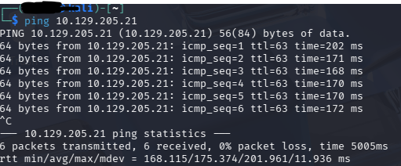
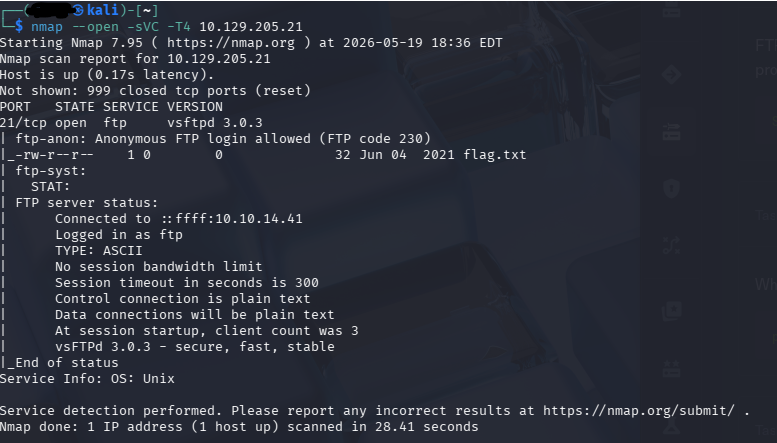
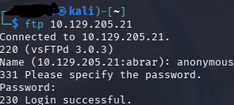
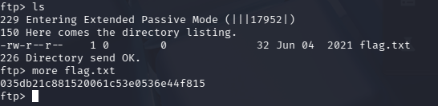

# Fawn Writeup

## Connecting to VPN

I connected to the Hack The Box VPN using OpenVPN.

```bash
sudo openvpn starting_point.ovpn
```


---
## Test connection 


```bash
ping  TARGET_IP
```



---

## Enumeration

```bash
nmap --open -sVC -T4 TARGET_IP
```



The scan revealed that port 21 was open.

FTP stands for File Transfer Protocol and is used for file sharing.


## FTP Connect 

```bash
ftp  TARGET_IP
```



I logged in as `anonymous` because we did not have valid account credentials.

## Flag



