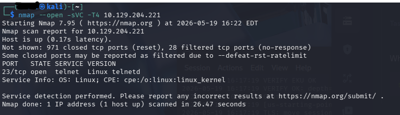
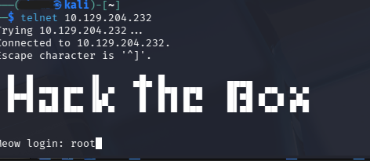
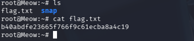

# Meow Writeup

## Connecting to VPN

I connected to the Hack The Box VPN using OpenVPN.

---

## Enumeration
I used Nmap to scan the target for open ports.

## Telnet Connection
I connected to the Telnet service because port 23 was open.
I logged in as root.

## Flag

 

